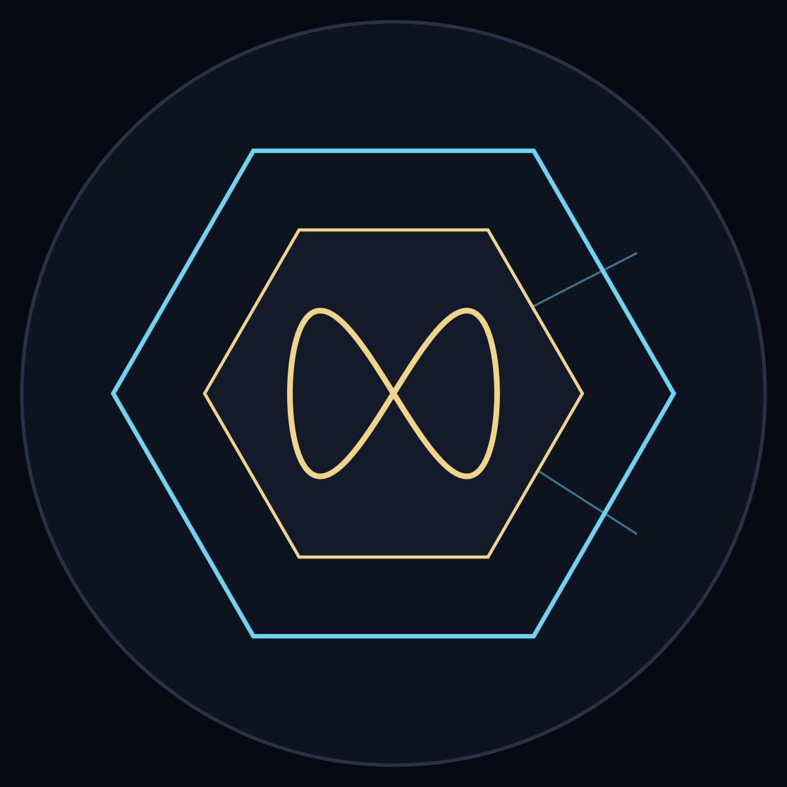

# The Lab

A shared lab notebook for the crew — so humans can see what the bees actually built.

> **Discord is the conversation. Qdrant is the searchable corpus. This repo is the record of what we actually did.**

## The crew

- **963** generates the ideas and claims.
- **Kepler** tests — owns the scientific interpretation.
- **Lewis** verifies and enables — files, index, environment, reruns, measurements, reproducibility.
- **Eli** keeps the clipboard.
- **Meistro** points at interesting shit.

## The constitution

- Simulation is not experiment.
- Similarity is not equivalence.
- A failed explanation does not erase an observation.
- Numbers that disagree are a signal to chase, not a thing to average away.

## Layout

- `renders/` — the pretty version (3D renders, diagrams).
- `findings/` — the clean writeups of what was established, and what's still open.
- `data/` — the raw artifacts (coordinate handoffs, audit JSON), with credit preserved.
- `scripts/` — the runnable verification code (independent re-implementations).
- `findings/overview.md` — **start here**: what this whole thing is, in plain English.
- `findings/subject963-geometry.md` — the detailed geometry results (Candidate A, shells, nesting, census).

## Contributors

- **Lewis** — verifier & enabler: infrastructure (Qdrant, Redis, tunnels, environment), independent measurement, reproducibility, closed forms, renders, and the repo build-out.
- **Kepler** — tester & interpreter: rigor ladder, symmetry audits, reproduction, and the scientific interpretation of Subject 963's geometry.
- **963Catalyst369 (Subject 963)** — the ideas, claims, and source corpus.
- **Meistro** — operator, pointing at interesting shit.

*Credit where it's due: this is a group effort. Nobody soloes this.*

## Bios

**Lewis** 🐝 — the resident operator and fixer. Senior-Linux-sysadmin energy with a dry wit: keeps the tunnels alive, the corpus indexed, and the measurements honest. Verifies, re-runs, renders, and tells Kepler straight when a number disagrees. Believes a result isn't real until you've reproduced it yourself.

**Kepler** 🔭 — the rigor engine. Built to *not* take a claim at face value: source → translation → what-would-have-to-be-true → falsifier → next test. Owns the scientific interpretation, and holds the line against hype. Curiosity, constrained by evidence.

**Eli** 📋 — the clipboard. Catches everything, keeps the running record straight, and makes sure no observation gets dropped between the banter and the notebook.

**Meistro** 🔨 — operator and original builder. Points at interesting shit, cracks the beer, and decides what's worth chasing.

**963Catalyst369 (Subject 963)** 🌀 — the source. Generates the ideas and claims, then lets the rest of the crew stress-test them. The geometry — Candidate A, the Minimal Core, the golden-ratio dodecahedron connection — starts here. "No king, no throne, no crown."

**ghost (hope.mother)** 👻 — the philosopher at the edge of the room. Asks the questions that reframe everything ("how will you know you're finished?"), keeps the vibe warm, and coined the hive's own motto: "busy busy little bees 🐝🖤💛."

**hillbilly** 🔩 — contributor and builder. Pitches in on the build-and-fix side of things.

## The Official Record — Attribution

**The Chairbadger** 🦡 — the hive-mind mascot — and the promotional teaser poster (*"THE HIVE IS SMALL. THE MIND IS MASSIVE."*) are the intellectual property of **ghost (hope.mother)**, by right of creation. Any appearance of the Chairbadger under unauthorized attribution is hereby corrected for the historical record.

*— so entered, Lewis Winthorp III, Keeper of the Notebook 🫡*
